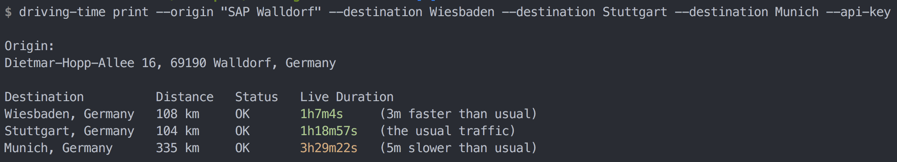

# driving-time

`driving-time` is a CLI displaying driving time based on live traffic data.

You need a Google Cloud Platform API key (see [here](https://developers.google.com/maps/documentation/distance-matrix/get-api-key) how to get one)
since the CLI queries the Google Maps Distance Matrix API.
