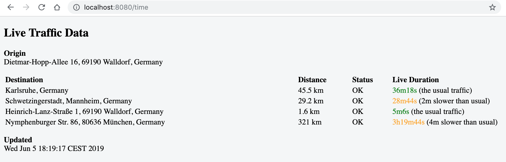
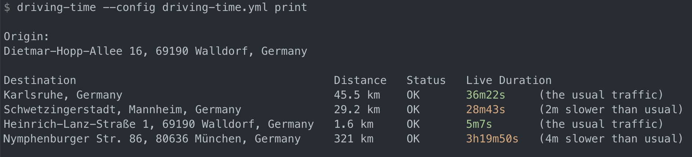

# driving-time

`driving-time` is a CLI (and server) displaying driving time based on live traffic data.

## Installation
Options:
1. Download the binary in https://github.com/ansd/driving-time/releases
1. Use Homebrew: see https://github.com/ansd/homebrew-tap
1. Build from source: `go get github.com/ansd/driving-time`

## Usage
Create a config file (e.g. `driving-time.yml`) like the one in [driving-time.yml.template](driving-time.yml.template).

For `api-key`, you need a Google Cloud Platform API key (see [here](https://developers.google.com/maps/documentation/distance-matrix/get-api-key) how to get one)
since the CLI queries the Google Maps Distance Matrix API.

Start the server:
```
$ driving-time --config driving-time.yml serve
```


You can optionally provide a `cron` schedule in the config file. This enables the server to cache the last response from Google Maps Distance Matrix API and return the cached response to the client. You can use [synoptico](https://github.com/friegger/synoptico) to poll the server every [timer](https://github.com/friegger/synoptico/blob/2b1c3daf1c930681ff89d84394f5ce4760743c99/docs/examples/sample.json#L5) seconds. The cron schedule invalidates the cached response forcing the server to request the Google Maps Distance Matrix API.

Alternatively, print live traffic data on the command line:

